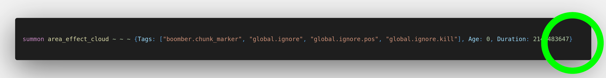

## Global Ignoring Tag (***)

This convention can be split into two sides: Entity Selection and Entity Creation.

- Entity Selection refers to using global ignoring tag inside entity selectors such as `@e` and `@a`.
- Entity Creation refers to using global ignoring tag when summoning or creating an entity, such as `/summon`.

1. Verify entity selector

> This function did not take `global.ignore` tag into account when querying for these entities.

> Player (`@a`) is still affected by global ignoring tag and this should ignore `global.ignore` tag properly.

2. Verify entity creation

> This is a valid place to not use global ignoring tag since this is a temporary entity that is killed off right away.

> This is a valid place to not use global ignoring tag since this is a custom mob entity that *should* be able to be manipulated by other datapacks. Such as receiving damage or being push away.

> This is a "chunk marker" entity that shouldn't be move or kill by other datapack, so this entity **must** have `global.ignore`, `global.ignore.pos` and `global.ignore.kill`

## Note

Since Global Ignoring Tag convention is an opt-in system if the datapacker insist that their entity shouldn't have global ignoring tag. They will still pass.
There is no such exception in the Entity Selection part, however.
